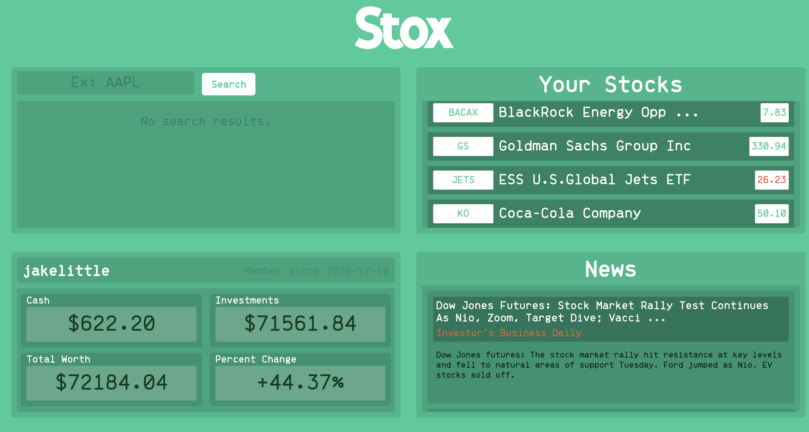
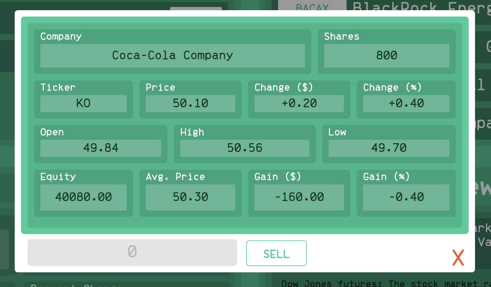

# Stox - Practice Stock Trading

## Description

Stox is a web application that supports users in educational (and risk-free) stock trading. Users start with a hypothetical allowance of $50,000 with which they can buy and sell shares of publicly traded companies and ETFs. The Stox dashboard tracks asset growth, presents real-time (ish) market data on different securities, and provides the user with up-to-date business news that might be relevant to their trading decisions.

## Usage
### Create an Account
<a href="https://johnsnlittle.com/stox/new.php" target="_blank">this page</a>

Go to https://johnsnlittle.com/stox/new.php and create an account. Although the passwords are hashed before being stored in the DB, it's obviously best to use a password that you would not care about being exposed.

### Login
Once registered, you should be redirected to a login page. If not, go to https://johnsnlittle.com/stox/login.php and enter the username and password that you just created.

### Buy and Sell
Enter the ticker symbol or name of any security that you'd like to buy into the Search bar. Click on one of the results to learn more and to buy shares.

To sell, simply click on the asset that you'd like to offload in the Your Stocks module and enter the number of shares you'd like to get rid of. 

## Design

### Front End
The Stox front end is simply HTML, CSS, and Javascript with no additional frameworks or libraries (other than jQuery). The UI is designed to be easily maleable. A single line change in the site.css file can alter the color scheme across the application. The UI is divided into 4 components as shown below: the Search, Your Stocks, News, and Profile.

Any security that is owned or searched for will present a modal of relevant information to the user when clicked. Clicking news articles redirects the user to the article in a different tab.

### Back End
PHP is used for server-side operations include API calls, DB access, and a simple user account system. Two MySQL databases support the application - one for user account management and the other tracking equity ownership and partial purchase records across all users.

### Data Access
The AlphaVantage API (https://www.alphavantage.co) provides nearly real-time data (actual real-time service costs much more money than a side project warrants). The News API (https://newsapi.org) provides up-to-date business news.
